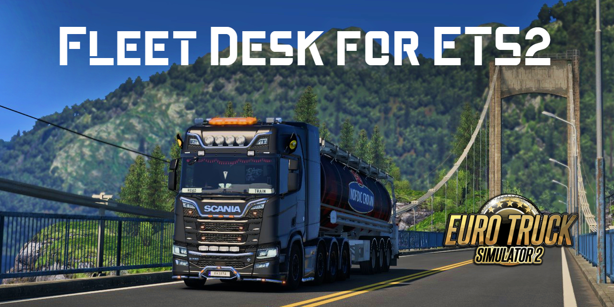

# Fleet Desk for ETS2

Fleet Desk is a desktop app that lets you create **real, valid ETS2 jobs** straight from your own save files.  
It reads your profile, checks what DLCs you own, and only suggests jobs you can actually take in-game.

No hacks, no fake offers — just jobs that follow the same rules as ETS2.

---

## What it does (MVP)

- Auto-detects your ETS2 profiles
- Checks if your game is using text saves (`g_save_format 2`)
- Detects installed map/cargo DLCs (Heavy, Special, Iberia, etc.)
- Reads player info: level, skills, discovered cities, owned trailers
- Exports a job spec (JSON) for testing  
  _Next step: actually write jobs into the save file with backups._

## Roadmap

- ✅ Profile + DLC detection
- ✅ Player state reading (level, skills, cities, trailers)
- ⏳ Save writer: clone an existing job and swap fields safely
- ⏳ Telemetry autofill (read-only): nearest city from your current location
- ⏳ Share/import job codes with friends
- ⏳ City/company/cargo dictionaries with DLC gating

> This is an MVP build.  
> The full version will have a clean, simple UI and a realistic dispatch-style job list.

#### Documentation

Instructions, feature details, and editing guides will be stored in [**`/docs`**](fleet-desk/docs). The folder is empty for now cuz i'm prepping content.